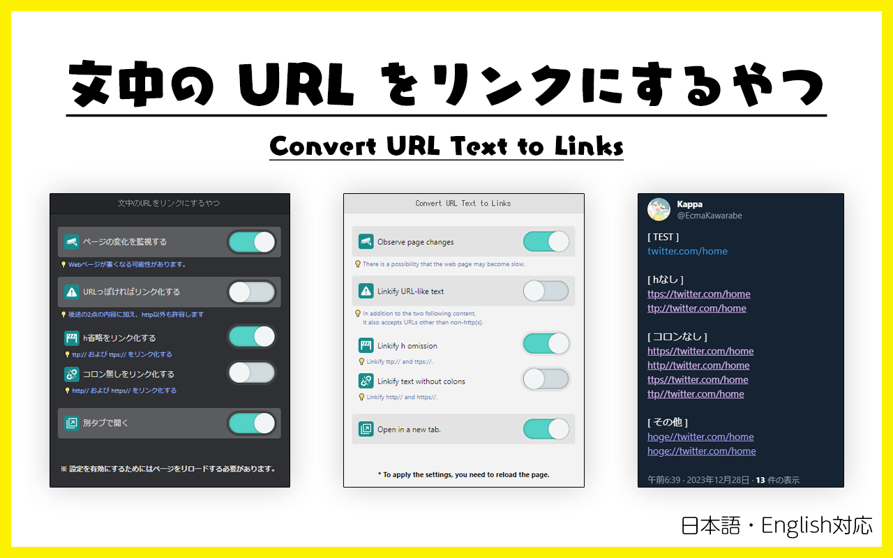

# クリックできない URL をクリックできるようにするやつ

文中のURLをリンクにするだけのブラウザ拡張です。

[English version is here.](./README.md)

## ダウンロード

## 使い方

1. このブラウザ拡張のアイコンをクリックします
2. 必要に応じて設定を変更します（チェックボックス）
3. ネットサーフィンをお楽しみください

動作テスト用ページ: <https://heppokofrontend.dev/demo/chrome-extension-convert-url-text-to-links>
