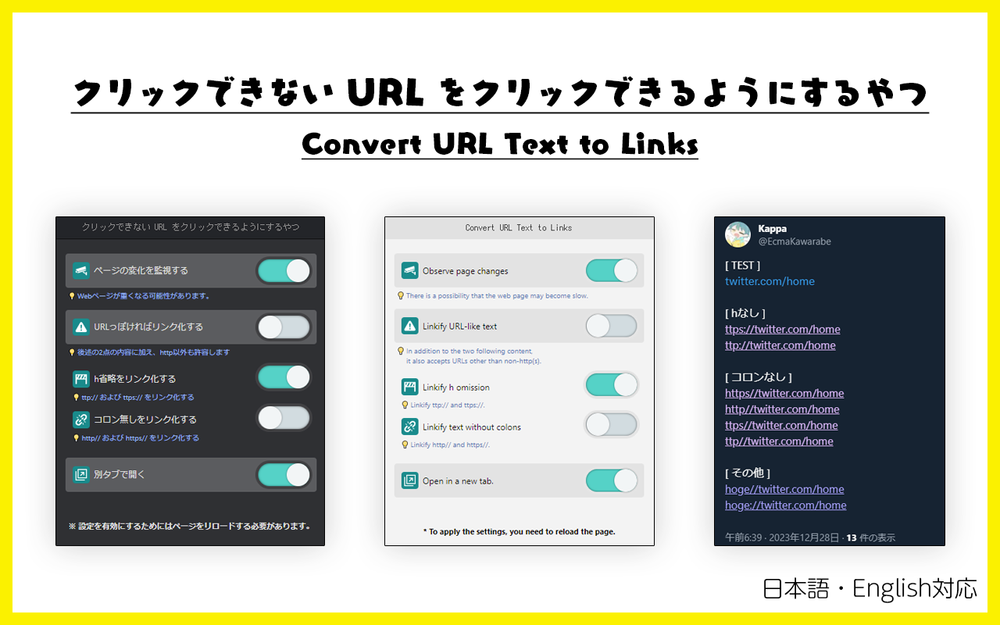

# 文中の URL をリンクにするやつ

English follows.

文中の URL をリンクにするだけのブラウザ拡張です。

## ダウンロード

WIP

<!--  -->

## 使い方

1. このブラウザ拡張のアイコンをクリックします
2. 必要に応じて設定を変更します（チェックボックス）
3. ネットサーフィンをお楽しみください

# Convert URL Text to Links

It is a browser extension that simply converts URLs in the text into links.

## Download

WIP

## How to use

1. Click on the icon for this browser extension
2. Change settings as needed (check boxes)
3. Enjoy surfing the web!
